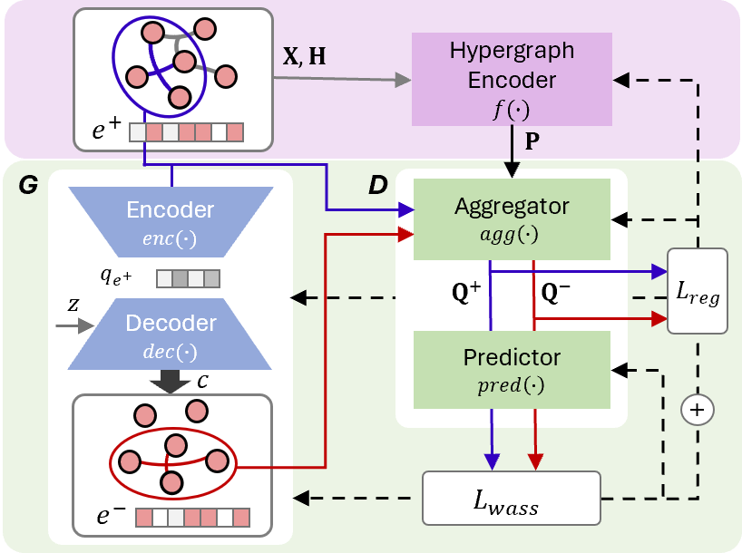
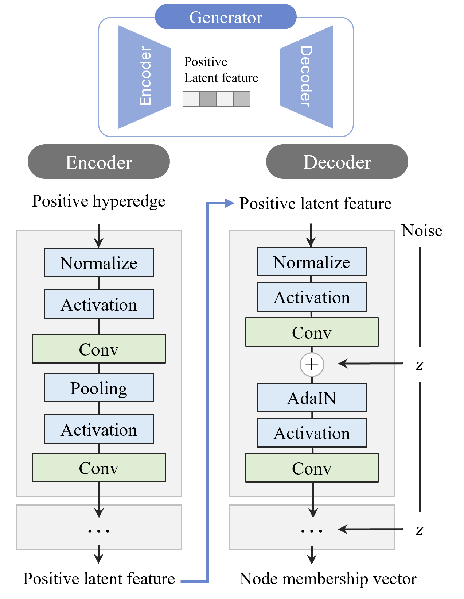

# HyGEN: Regularizing Negative Hyperedge Sampling for Accurate Hyperedge Prediction

## Authors

- Song Kyung Yu (ssong915@hanyang.ac.kr)
- Da Eun Lee (ddanable@hanyang.ac.kr)
- Yunyong Ko (yyko@cau.ac.kr)
- Sang-Wook Kim (wook@hanyang.ac.kr)

## Overview

<p align="center">

</p>

- **Challenges**
  - We point out two important challenges of negative sampling in the hyperedge prediction: (C1) lack of guidance for generating negatives and (C2) possibility of false negatives.
- **Method**
  - We propose a novel hyperedge prediction method, **HyGEN** that employs (1) a positive-guided negative hyperedge generator for (C1) and (2) a regularization term for (C2).
- **Evaluation**
  - Via extensive experiments on six real-world hypergraphs, we verify the superiority of HyGEN over four state-of-the-art hyperedge prediction methods.

## Detailed architecture of the generator

We propose a positive-guided negative hyperedge generator.

For effectively extracting the characteristics of positive hyperedges and injecting them into generated negative hyperedges,
inspired by [stargan-v2](https://github.com/clovaai/stargan-v2),
we adopt a convolutional neural network (CNN) with three layers as the architecture of the encoder and decoder as below.

<p align="center">

</p>

Each of these consists of a 1-D convolutional layer with 256 kernels of size 3, average-pooling, and LeakyReLU as the activation function.
In the case of the decoder, we additionally use adaptive instance normalization (AdaIN), which follows each convolutional layer, in order to inject the characteristics of the positive hyperedge into the generated negative hyperedge.

## Datasets

|   Name   | #Nodes | #Edges |    Domain     |
| :------: | :----: | :----: | :-----------: |
| Citeseer | 1,457  | 1,078  |  Co-citation  |
|   Cora   | 1,434  | 1,579  |  Co-citation  |
|  Cora-A  | 2,388  | 1,072  |  Authorship   |
|  Pubmed  | 3,840  | 7,962  |  Co-citation  |
|  DBLP-A  | 39,283 | 16,483 |  Authorship   |
|   DBLP   | 15,639 | 22,964 | Collaboration |

### Dataset format

Each dataset file contains following keys: 'N_edges', 'N_nodes', 'NodeEdgePair', 'EdgeNodePair', 'nodewt', 'edgewt', 'node_feat'.
We also provide preprocessed splits, each of which contains train, validation, and test sets (both positive and negative).
They can be found in `split/` at [Here](https://drive.google.com/drive/folders/1O9xDCxSe0CPrG4tzFICsTwU1RRavie5I?usp=sharing).

## Execution

### Dependencies

Our code runs on Intel i7-7700k CPU, 64 GB memory, and a GeForce RTX 2080 GPU with CUDA 12.2 and cuDNN 8.2.1, with the following packages installed `./HyGEN/HyGEN.yaml`.

### How to run

```
python hyperedge_prediction.py --dataset_name cora --model hnhn --epochs 200 --train_DG 1:1
```

More details about arguments are described in `./HyGEN/utils.py`.
